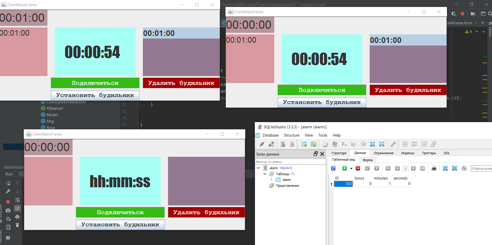
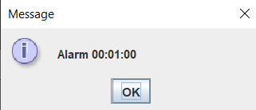
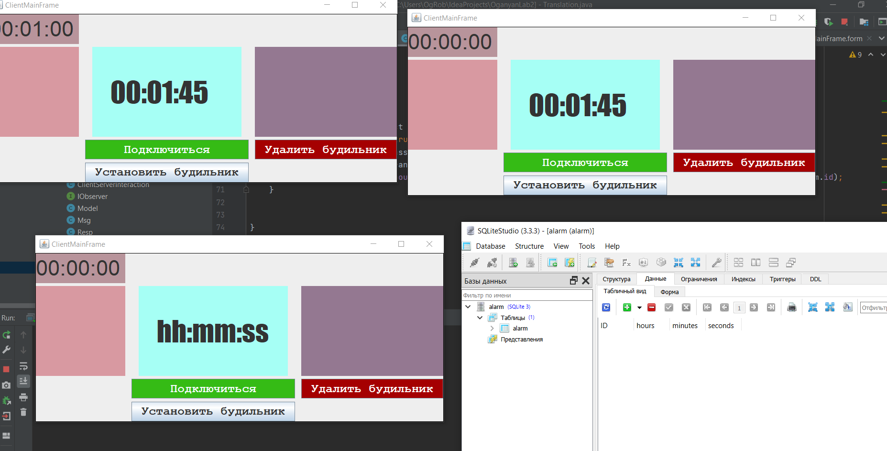
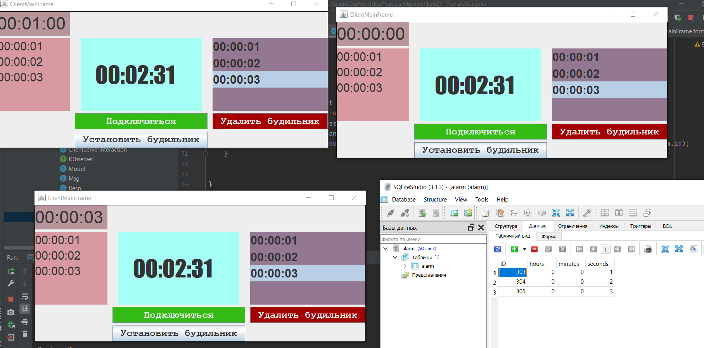
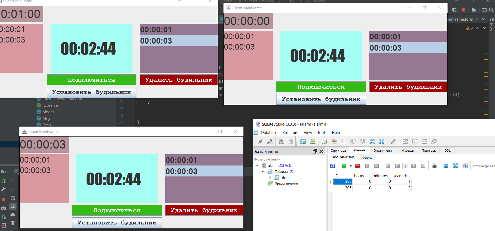

## Alarm&clock server-client system using Database for storing Alarms

*P.s:Project might not work due to changed name of the folder. Rename it to OganyanLab2*

* **ServerMain** is server runnable class
* **ClientMainFrame** is client runnable class

Erase  00:00:02

*P.s: there is a small bug. If you try to set alarm at the very end of the second (for example you set alarm at 00:00:03.59), the server WILL add the alarm to the database, but the client won't draw the alarm list because it won't get the message with appropriate code, because at this moment client gets another message to change time (forward clock to 1 second)*

